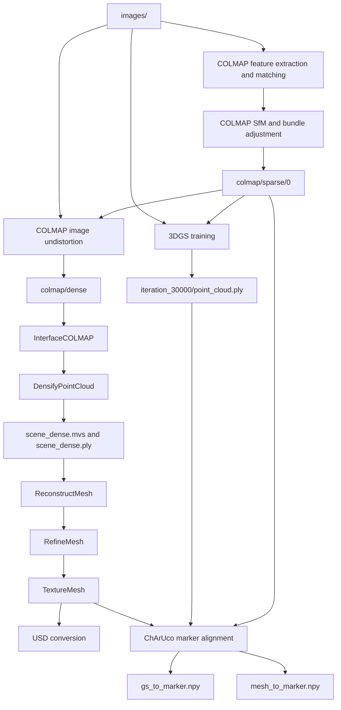

# Re3Sim Reconstruction Assets

This document explains the reconstructed scene stored under:

```text
Re3Sim/real-deployment/calibration/data/reconstruction_source/
```

It describes the reconstruction flow, the purpose of each major directory, the assets consumed by Re3Sim, and which intermediate files should be retained. Robot assets, hand-eye calibration, motor mapping, policy training, and real-robot deployment are documented elsewhere.

For executable environment and reconstruction commands, see [`../README_Container.md`](../README_Container.md). For simulated collection and replay, see [`re3sim/standalone/viperx/README_ViperX.md`](re3sim/standalone/viperx/README_ViperX.md).

## 1. Summary

The current `reconstruction_source/` is approximately **43 GB**:

| Directory | Approximate size | Purpose |
|---|---:|---|
| `images/` | 4.4 GB | Original scene photographs |
| `colmap/` | 5.2 GB | Camera poses, sparse reconstruction, and undistorted images |
| `gs/` | 3.9 GB | 3D Gaussian Splatting model, checkpoints, and renders |
| `mvs/` | 29 GB | OpenMVS depth maps, dense geometry, textured mesh, and USD |
| `progress.json` | A few KB | Coarse progress markers from the original pipeline |

The large size comes mainly from OpenMVS depth maps, duplicated undistorted images, the dense point cloud, and Gaussian training checkpoints. Only a small subset is needed at runtime.

The two final scene representations are:

- **3D Gaussian Splatting (3DGS):** photorealistic static background rendering.
- **OpenMVS mesh/USD:** explicit geometry for Isaac Sim scene placement and collision.

Both branches originate from the same COLMAP camera reconstruction and are aligned to the physical ChArUco marker.

## 2. Reconstruction Flow



In short:

```text
images     = original input
colmap     = camera locations and shared reconstruction coordinates
gs         = scene appearance
mvs        = scene geometry and collision representation
*.npy      = reconstruction-to-marker transformations
USD        = geometry package loaded by Isaac Sim
```

## 3. Core Scripts

### Full Reconstruction Entry Point

```text
Re3Sim/re3sim/scripts/reconstruct.py
```

It orchestrates COLMAP, 3DGS training, image undistortion, OpenMVS reconstruction, marker alignment, and USD conversion.

### Resume from Dense Reconstruction

```text
Re3Sim/re3sim/scripts/resume_reconstruct_from_dense.py
```

This script resumes from existing:

```text
mvs/scene_dense.mvs
mvs/scene_dense.ply
```

It runs mesh reconstruction, refinement, texturing, mesh-to-marker alignment, and USD conversion. Existing complete outputs are skipped so the expensive dense reconstruction does not need to be repeated.

### Gaussian Training and Alignment

```text
Re3Sim/re3sim/gaussian_splatting/train.py
Re3Sim/real-deployment/utils/compute_transform_to_marker_aruco.py
```

The first script trains the Gaussian model. The second computes the transforms from the Gaussian and COLMAP/OpenMVS coordinates to the physical ChArUco marker.

## 4. Directory Contents

### `images/`: Original Input

`images/` contains 282 sequentially numbered scene photographs. They are used by COLMAP, 3DGS, OpenMVS, and marker alignment.

These photographs are the only irreplaceable reconstruction input. Every other reconstruction artifact can theoretically be regenerated from them, although doing so may require many hours.

### `colmap/`: Cameras and Shared Coordinates

Important contents include:

```text
colmap/
├── database.db             Feature and image-matching database
├── vocab_tree.bin          Matching cache
├── sparse/0/               Registered cameras, poses, and sparse points
├── sparse/text/            Text export of the same sparse model
└── dense/                  Undistorted images and dense-workspace metadata
```

`sparse/0/` is the shared geometric basis for both 3DGS and OpenMVS. It contains camera intrinsics, image poses, and the sparse point cloud. Of the 282 input images, 280 were registered and used by the completed reconstruction.

`dense/images/` contains lens-undistorted images rather than a simple backup of the originals. OpenMVS consumes these pinhole-camera images.

`colmap/sparse/0/colmap_to_marker.npy` stores the scale and pose that map COLMAP/OpenMVS coordinates into the marker frame. The mesh branch copies this result to `mvs/mesh_to_marker.npy`.

### `gs/`: Gaussian Appearance Model

The completed model is under `gs/0/`. Its important files are:

| Path | Purpose |
|---|---|
| `cameras.json` | Registered training-camera poses |
| `input.ply` | Sparse initialization points |
| `cfg_args` | Training configuration snapshot |
| `point_cloud/iteration_30000/point_cloud.ply` | Final runtime Gaussian model |
| `gs_to_marker.npy` | Gaussian-to-marker scale and pose |
| `chkpnt30000.pth` | Optional resumable training checkpoint |
| `train/ours_30000/` | Optional ground-truth and rendered quality checks |

The final training result reached 30,000 iterations, with approximately `L1 = 0.02699` and `PSNR = 26.30 dB`.

The 7,000-iteration model, checkpoints, TensorBoard events, and comparison renders are not required for runtime rendering. `gs/1/` is an unfinished experiment and is not the active result.

### `mvs/`: Explicit Geometry

The OpenMVS branch follows:

```text
scene.mvs
  -> depth####.dmap
  -> scene_dense.mvs + scene_dense.ply
  -> scene_dense_mesh.ply
  -> scene_dense_mesh_refine.ply
  -> scene_dense_mesh_refine_texture.ply
  -> USD
```

Key outputs are:

| Path | Purpose |
|---|---|
| `depth####.dmap` | Per-view dense depth caches; the largest storage consumer |
| `scene_dense.ply` | Fused dense point cloud |
| `scene_dense_mesh.ply` | Initial triangle mesh |
| `scene_dense_mesh_refine.ply` | Image-guided refined mesh |
| `scene_dense_mesh_refine_texture.ply` | Final textured source mesh |
| `scene_dense_mesh_refine_texture*.png` | Texture atlases |
| `mesh_to_marker.npy` | Mesh-to-marker scale and pose |
| `scene_dense_mesh_refine_texture_non_metric.usd` | Imported geometry layer |
| `scene_dense_mesh_refine_texture.usd` | Metric, Z-up Isaac Sim entry layer |

The final USD may reference the non-metric layer and external textures. Deploy the two USD files and all texture dependencies together.

`mvs/images` and `mvs/sparse` are container-side helper symlinks to the original images and COLMAP sparse model. They do not duplicate the underlying data and may appear broken when viewed outside the container.

## 5. Runtime Assets

Re3Sim directly consumes the following reconstruction outputs.

### Geometry Branch

```text
mvs/scene_dense_mesh_refine_texture.usd
mvs/scene_dense_mesh_refine_texture_non_metric.usd
mvs/scene_dense_mesh_refine_texture*.png
mvs/textures/
mvs/mesh_to_marker.npy
```

### Visual Branch

```text
gs/0/point_cloud/iteration_30000/point_cloud.ply
gs/0/gs_to_marker.npy
```

The task configuration additionally requires the robot-calibration result:

```text
Re3Sim/real-deployment/calibration/data/viperx_hand_eye/marker_2_base.npy
```

`marker_2_base.npy` is not produced by scene reconstruction. It maps the physical marker frame into the ViperX base frame, completing the coordinate chain used by the task.

## 6. Resource Constraints and Quality Trade-offs

The reconstruction used 282 images at 5712×4284 resolution. COLMAP and OpenMVS therefore required controlled concurrency and host swap.

| Operation | Effective setting | Main effect |
|---|---:|---|
| COLMAP SIFT | 4 threads, `SINGLE` camera | Lower memory use; shared intrinsics for one camera |
| OpenMVS densify | 2 CUDA instances, 8 threads | Lower concurrency without intentional quality loss |
| Mesh reconstruction | 4 px minimum point distance, 2M target faces, 4 threads | Lower memory use with some loss of fine geometry |
| Mesh refinement | Resolution level 2, 4 threads | Largest geometry-quality compromise |
| Texture generation | 4 threads | Lower concurrency |
| 3DGS | 30,000 iterations | Full training schedule retained |
| 3DGS input | Automatically resized to about 1.6K width | Lower GPU cost with reduced finest visual detail |

The successful OpenMVS run used a 32 GiB host swap file, a 24 GiB container RAM limit, and a 56 GiB combined memory-plus-swap limit. These limits affect runtime, not coordinate conventions or output formats.

`progress.json` is not a reliable completion certificate. It records coarse steps attempted by the original script and is not updated by the resume script. Verify completion from the actual final assets listed in Section 5.

## 7. Retention Policy

This section describes deletion safety only; it does not instruct any automatic deletion.

### Highest Priority

Always retain:

- `images/`.
- `colmap/sparse/0/`.
- The final Gaussian PLY and `gs_to_marker.npy`.
- Both final USD layers, all texture dependencies, and `mesh_to_marker.npy`.
- `scene_dense_mesh_refine_texture.ply` as the high-quality source for future USD exports.

### Keep Until Scene Validation and Backup

Keep these while tuning or validating reconstruction:

- `colmap/database.db` and `colmap/dense/`.
- `mvs/scene.mvs`.
- `mvs/depth*.dmap`.
- `mvs/scene_dense.mvs` and `mvs/scene_dense.ply`.
- Initial and refined meshes.
- `gs/0/chkpnt30000.pth`, `cameras.json`, `cfg_args`, and `input.ply`.

### Regenerable Large Files

After final scene validation and backup, the following can be regenerated but may be expensive:

- OpenMVS depth maps and dense point cloud.
- Undistorted COLMAP images.
- Gaussian checkpoints and the 7,000-iteration model.
- Ground-truth/render comparison images.
- COLMAP feature database and vocabulary tree.

The depth maps are the largest obvious storage-recovery candidate, but deleting the only copy removes the ability to resume quickly from the dense reconstruction.

### Non-Runtime Results

The following are not active runtime assets:

- Empty or unfinished `gs/1/` experiments.
- Empty OpenMVS log files.
- `progress.json`.
- `*.pre_finite_filter.npy` diagnostic transforms.
- Helper symlinks under `mvs/`.

## 8. Partial Reruns

| Goal | Earliest required inputs |
|---|---|
| Rebuild everything | `images/` |
| Rebuild COLMAP SfM | `images/`; the old database is optional |
| Retrain 3DGS | `images/` and `colmap/sparse/0/` |
| Render the final 3DGS model | Final Gaussian, camera configuration, and corresponding images |
| Repeat image undistortion | `images/` and `colmap/sparse/0/` |
| Repeat OpenMVS densification | `scene.mvs` and its undistorted images/cameras |
| Rebuild the mesh from dense output | `scene_dense.mvs` and `scene_dense.ply` |
| Repeat mesh refinement | `scene_dense.mvs`, initial mesh, and undistorted images |
| Repeat texturing | `scene_dense.mvs`, refined mesh, and images |
| Recompute mesh-to-marker | COLMAP sparse model, original images, and textured mesh |
| Recompute GS-to-marker | `gs/0/cameras.json` and original images |
| Re-export USD | Textured PLY, texture atlases, and the USD conversion environment |

The current photographs, COLMAP model, final 3DGS, textured OpenMVS mesh, marker-alignment transforms, and USD assets are complete reconstruction products. Routine work should consume these assets through the task configuration rather than generate additional reconstruction intermediates.
