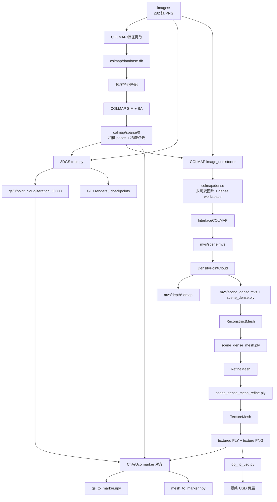

# Re3Sim `reconstruction_source` 重建产物说明

本文只解释一个目录：

```text
Re3Sim/real-deployment/calibration/data/reconstruction_source/
```

它回答以下问题：

- `reconstruct.py` 实际执行了哪些步骤；
- `images/`、`colmap/`、`gs/`、`mvs/` 和 `progress.json` 分别是什么；
- 原流程失败后，`resume_reconstruct_from_dense.py` 从哪里继续；
- 现在生成的几十 GB 文件分别有什么用；
- 哪些是 Re3Sim 最终消费的资产，哪些只是重算缓存。

本文不展开 ViperX URDF、adapter、shooting、hand-eye 和 `marker_2_base.npy`。它们属于重建流程以外的另一条标定支线。

## 1. 先看结论

当前 `reconstruction_source/` 约 **43 GB**：

| 目录 | 当前大小 | 本质 |
|---|---:|---|
| `images/` | 约 4.4 GB | 282 张原始场景照片 |
| `colmap/` | 约 5.2 GB | 相机定位、稀疏点云和去畸变工作区 |
| `gs/` | 约 3.9 GB | 3D Gaussian Splatting 训练结果、checkpoint 和 render |
| `mvs/` | 约 29 GB | OpenMVS 深度图、稠密点云、网格、纹理和 USD |
| `progress.json` | 4 KB 文件系统占用 | 原始脚本的粗粒度进度标记 |

体积最大的不是最终场景 USD，而是：

1. `mvs/depth####.dmap`：280 张视角的 OpenMVS 深度缓存，每张约 96 MB；
2. `images/` 与 `colmap/dense/images/`：原图和去畸变图各保留一份；
3. `mvs/scene_dense.ply`：约 3.1 GB 的稠密点云；
4. 3DGS checkpoints、最终 Gaussian 和 560 张 GT/render 对比图。

真正用于 Re3Sim 场景运行的核心结果主要是：

```text
mvs/scene_dense_mesh_refine_texture.usd
mvs/scene_dense_mesh_refine_texture_non_metric.usd
mvs/scene_dense_mesh_refine_texture*.png
mvs/mesh_to_marker.npy

gs/0/point_cloud/iteration_30000/point_cloud.ply
gs/0/gs_to_marker.npy
```

其余大部分文件是生成这些结果所需的输入、中间结果、恢复点或质量检查结果。

## 2. 一张图看懂执行过程



这条流程产生两种互补的场景表示：

- **3DGS**：负责高保真的静态背景外观；
- **OpenMVS mesh/USD**：负责显式几何、Isaac Sim 场景载体和碰撞。

两者共享 COLMAP 求出的相机轨迹，但各自保存一份到 ChArUco marker 的变换。

## 3. 哪些脚本参与了这次重建

### 3.1 原始总入口

```text
Re3Sim/re3sim/scripts/reconstruct.py
```

它依次负责：

1. COLMAP 特征提取、匹配和 SfM；
2. 启动 3DGS 训练；
3. COLMAP 图片去畸变；
4. OpenMVS 转换、稠密重建、网格、细化、纹理；
5. GS/mesh 到 marker 的对齐；
6. textured mesh 转 USD。

原计划是一个命令从照片直接跑到底，但这次 282 张 5712×4284 图片使 OpenMVS 网格阶段超过当前机器内存，因此后半段没有继续由这个脚本完成。

### 3.2 我们新增的续跑脚本

```text
Re3Sim/re3sim/scripts/resume_reconstruct_from_dense.py
```

它只消费已经成功生成的：

```text
mvs/scene_dense.mvs
mvs/scene_dense.ply
```

然后继续：

```text
ReconstructMesh
→ RefineMesh
→ TextureMesh
→ mesh-to-marker
→ USD conversion
```

它会检查预期输出；已有完整输出就跳过，出现部分输出则停止让人检查，避免每次重跑都重新计算几个小时的 dense 阶段。

### 3.3 另外手动运行的两个步骤

3DGS 首次被 `reconstruct.py` 启动后没有正常训练到 30000 步，但原脚本没有用 `check=True` 检查子进程退出码，仍然把 `progress.json` 中的 `gaussian` 写成了 `true`。后来单独运行：

```text
Re3Sim/re3sim/gaussian_splatting/train.py
```

完成了 30000 步训练。

随后单独运行 render，生成了：

```text
gs/0/train/ours_30000/gt/
gs/0/train/ours_30000/renders/
```

再运行：

```text
Re3Sim/real-deployment/utils/compute_transform_to_marker_aruco.py
```

生成 `gs_to_marker.npy`。OpenMVS 的 `mesh_to_marker.npy` 也由同一个对齐工具产生。

## 4. 根目录每一项是什么

当前根目录可以简化为：

```text
reconstruction_source/
├── images/          # 唯一原始输入照片
├── colmap/          # 相机定位和 COLMAP 工作区
├── gs/
│   ├── 0/           # 已完成的 3DGS 主结果
│   └── 1/           # 当前基本为空的实验目录
├── mvs/             # OpenMVS、纹理、对齐和 USD
└── progress.json    # 原 reconstruct.py 的粗粒度进度
```

下面按执行顺序解释。

## 5. `images/`：唯一原始输入

当前内容：

```text
images/000000.png
images/000001.png
...
images/000281.png
```

共 282 张，约 4.4 GB。

它们是从手机照片整理出的重建输入。顺序编号用于让 sequential matching 按相邻拍摄顺序找匹配关系。

这些照片同时被三处消费：

- COLMAP：提取特征并恢复相机位置；
- 3DGS：作为训练真值图像；
- ChArUco 对齐：从照片中检测板，建立重建坐标系到 marker 的变换。

这是整个重建目录里最不可替代的数据。其他结果理论上都可以从它们重新计算，但代价可能是数小时到数十小时。

## 6. `colmap/`：相机定位与共同坐标骨架

COLMAP 做的核心工作不是生成最终网格，而是回答：

```text
每张照片是从哪里、朝哪个方向拍的？
不同照片中的同一个视觉特征在三维空间哪里？
```

这些相机 poses 同时供 3DGS 和 OpenMVS 使用。

### 6.1 `database.db`

生成位置：

```text
colmap/database.db
```

当前约 556 MB。

生成函数：

```text
reconstruct.py::extract_features()
reconstruct.py::feature_matching()
```

数据库保存：

- 282 张图片的登记信息；
- SINGLE camera 模型和内参；
- 每张图的 SIFT keypoints/descriptors；
- 图片对之间的匹配关系。

它是 COLMAP 工作数据库，不会被 Re3Sim 运行时读取。

本次早期错误曾为很多图片各建一个 camera。修正为 `pycolmap.CameraMode.SINGLE` 后重新生成数据库；当前同一手机序列共享一套相机内参。

### 6.2 `vocab_tree.bin`

生成位置：

```text
colmap/vocab_tree.bin
```

约 15 MB，由 `reconstruct.py::download_vocab_tree()` 下载。

它帮助 sequential matching 查找可能匹配的图像。它是通用词汇树缓存，不包含你的场景几何，也不用于最终渲染。

### 6.3 `sparse/0/`

由：

```text
pycolmap.incremental_mapping()
```

生成。

主要文件：

| 文件 | 内容 |
|---|---|
| `cameras.bin` | 相机模型和内参 |
| `images.bin` | 已注册图像、相机外参和二维观测 |
| `points3D.bin` | 稀疏三维点、颜色和观测轨迹 |
| `points3D.ply` | 稀疏点云的可视化版本 |
| `rigs.bin`、`frames.bin` | 新版 COLMAP 的 rig/frame 元数据 |

输入有 282 张，当前 dense workspace 有 280 张，说明 COLMAP 成功注册并继续使用了 280 个视角；两张未进入最终注册模型。这不是重复生成，也不是目录损坏。

### 6.4 `sparse/text/`

`reconstruct.py` 把 binary sparse model 额外导出为文本：

```text
cameras.txt
images.txt
points3D.txt
rigs.txt
frames.txt
```

它们与 `sparse/0/*.bin` 是同一份 SfM 结果的文本表达，主要供人工检查和其他工具兼容，不是第二套重建。

### 6.5 `colmap_to_marker.npy`

位置：

```text
colmap/sparse/0/colmap_to_marker.npy
```

生成脚本：

```text
compute_transform_to_marker_aruco.py --data_type openmvs
```

它保存：

```text
T_marker_colmap
```

即把 COLMAP/OpenMVS 坐标表达转换到实体 ChArUco marker 坐标。矩阵的 3×3 部分还包含 SfM 到米制 marker 的尺度。

因为 OpenMVS mesh 延续 COLMAP 坐标系，续跑脚本会把它复制为：

```text
mvs/mesh_to_marker.npy
```

`colmap_to_marker.pre_finite_filter.npy` 是对齐求解过程中保留的诊断/早期结果，不是 Re3Sim 默认消费的结果。

### 6.6 `dense/`

生成命令：

```text
colmap image_undistorter
```

目录内容：

```text
colmap/dense/
├── images/                  # 280 张去畸变图片
├── sparse/                  # 与去畸变图对应的相机模型
├── stereo/
│   ├── depth_maps/          # COLMAP stereo 缓存；当前可为空或很少使用
│   ├── normal_maps/
│   ├── consistency_graphs/
│   ├── patch-match.cfg
│   └── fusion.cfg
├── run-colmap-geometric.sh
└── run-colmap-photometric.sh
```

`dense/images/` 不是原图的简单备份。COLMAP 根据相机模型去除了镜头畸变，OpenMVS 后续使用的是这组标准针孔图片。

这个目录约占 `colmap/` 的绝大部分，因为 280 张高分辨率去畸变 PNG 又保存了一遍。

## 7. `gs/`：3D Gaussian Splatting 视觉结果

当前：

```text
gs/0/    # 已完成，约 3.9 GB
gs/1/    # 约 4 KB，当前没有完成结果
```

### 7.1 `gs/0/cameras.json`

由 3DGS 数据加载阶段从 COLMAP sparse model 生成。

它包含 280 个已注册训练视角的：

- camera id；
- 图像名；
- 位置和旋转；
- 焦距和图像尺寸。

这里有很多 camera 记录是正常的。COLMAP 的 SINGLE camera 表示共用一套内参；`cameras.json` 的很多记录表示很多不同的拍摄姿态。

### 7.2 `input.ply`

约 6.5 MB，是 COLMAP 稀疏点云转换成的 3DGS 初始化点。

3DGS 从这些稀疏点开始增密和优化 Gaussian。它不是训练完成结果。

### 7.3 `cfg_args`

本次 3DGS 训练参数的文本快照，用来复现或 render 同一个 model。

### 7.4 `point_cloud/iteration_7000/point_cloud.ply`

约 271 MB，是 7000 步时保存的 Gaussian 状态。

它的顶点记录不是普通表面点云，而是一组 Gaussian primitives 的位置、尺度、旋转、透明度和颜色/球谐参数。

它是中间检查点；Re3Sim 默认不用它。

### 7.5 `point_cloud/iteration_30000/point_cloud.ply`

约 486 MB，是 30000 步完成后的 Gaussian 模型。

这是 3DGS 分支最重要的最终产物。Re3Sim 的 `GaussianRenderer` 默认加载：

```text
point_cloud/iteration_30000/point_cloud.ply
```

并根据仿真相机 pose 实时生成静态背景图像。

### 7.6 `chkpnt7000.pth` 与 `chkpnt30000.pth`

当前分别约 804 MB 和 1.41 GB。

它们保存可恢复的训练状态，方便继续训练或调参。它们不是 Re3Sim 在线渲染必需文件；只保留最终 PLY 也能加载已经训练好的 Gaussian，但不能完整恢复优化器状态继续训练。

### 7.7 TensorBoard event

```text
events.out.tfevents.*
```

记录训练 loss 等曲线。它只用于训练分析。

### 7.8 `train/ours_30000/gt/` 与 `renders/`

两边各 280 张：

- `gt/`：缩放到训练/评估分辨率的真实照片；
- `renders/`：从相同训练相机 pose 渲染的 3DGS 图片。

它们用于并排比较重建视觉质量和计算 L1/PSNR。本次训练结果为：

```text
L1   ≈ 0.02699
PSNR ≈ 26.30 dB
```

这些 560 张图片不会被 Re3Sim 运行时加载，可以从最终 Gaussian 和 camera poses 再次 render。

### 7.9 `gs_to_marker.npy`

由：

```text
compute_transform_to_marker_aruco.py --data_type gaussian
```

生成。

它保存：

```text
T_marker_gs
```

用于把 3DGS 的无尺度重建坐标放到实体 ChArUco marker 的米制坐标中。Re3Sim 的 background renderer 会读取它。

### 7.10 `gs/1/`

这是后来为了尝试另一组/全分辨率实验手工建立的目录，目前约 4 KB，没有完成的训练产物。

目录存在不代表训练完成；当前主结果是 `gs/0/`。

## 8. `mvs/`：为什么它占了约 29 GB

OpenMVS 把 COLMAP 的相机轨迹和去畸变照片转换成显式几何：

```text
相机和图片
→ 每视角深度
→ 融合稠密点云
→ 初始三角网格
→ 图像引导的网格细化
→ 纹理
→ USD
```

### 8.1 `scene.mvs`

约 13.6 MB。

生成命令：

```text
InterfaceCOLMAP
```

它把 `colmap/dense/` 转成 OpenMVS 工程，记录：

- camera；
- 图片路径；
- 稀疏点；
- view 与 scene 的关系。

它是 OpenMVS 的起始工程文件，不是 mesh。

### 8.2 `depth####.dmap`

当前约 280 个，每个约 96 MB，总体是 `mvs/` 最大的空间来源。

生成命令：

```text
DensifyPointCloud scene.mvs
```

每个 `.dmap` 保存一个视角的稠密深度估计和相关数据。日志中的：

```text
Estimated depth-maps
Geometric-consistent estimated depth-maps
Dense fused depth-maps
```

分别表示：

1. 根据多视图匹配估计每张图的深度；
2. 用邻近相机视角检查深度几何一致性；
3. 把一致深度融合成全局稠密点云。

屏幕看起来像“跑了两遍 depth map”，实际是估计和几何一致性过滤两个阶段，不是无意义重复。

### 8.3 `scene_dense.mvs`

约 14.8 MB，是 DensifyPointCloud 之后的 OpenMVS scene。它保存稠密重建后的工程关系，后续 ReconstructMesh/RefineMesh 继续使用。

### 8.4 `scene_dense.ply`

约 3.09 GB。

这是 280 视角深度融合后的全局稠密点云，是 `ReconstructMesh` 的输入。

它非常大，因为保存的是数千万个融合点，不是经过简化的最终表面。它不会被 Re3Sim 运行时直接加载。

### 8.5 `scene_dense_mesh.ply`

约 38 MB。

生成命令：

```text
ReconstructMesh
```

它通过 Delaunay/可见性等步骤把稠密点云转成初始三角网格。本次日志包括：

```text
Points inserted 42523197
Points weighted 14054995
Decimated faces 5326333
```

它已经是 mesh，但还没有完成图像引导细化和最终纹理。

### 8.6 `scene_dense_mesh_refine.ply`

约 7.8 MB。

生成命令：

```text
RefineMesh
```

RefineMesh 使用多个已知相机视角中的照片，调整网格顶点，让投影后的表面更符合照片。它不是再次生成 dense point cloud。

当前使用 `--resolution-level 2`，降低了细化使用的图像分辨率，因此它更容易在当前 RAM/swap 边界下完成，但会牺牲部分细小、薄片和高频几何。

### 8.7 `scene_dense_mesh_refine_texture.ply`

约 19.6 MB。

生成命令：

```text
TextureMesh
```

它是细化网格加上 UV/material/纹理引用后的 PLY。几何来自 refined mesh，外观来自多张照片融合得到的 texture atlas。

### 8.8 `scene_dense_mesh_refine_texture0/1/2.png`

由 TextureMesh 生成的纹理图集，总计约 150 MB。

它们不是普通照片，也不是 3DGS render；它们是按 UV 展开的 mesh 表面颜色贴图，必须和 textured mesh/USD 配套理解。

`mvs/textures/` 中出现的文件是 USD asset conversion 过程中整理/复制的纹理依赖。部署 USD 时不要只复制最外层 `.usd` 而丢掉配套 USD 层和纹理文件。

### 8.9 `mesh_to_marker.npy`

由 OpenMVS marker alignment 产生，实际是从：

```text
colmap/sparse/0/colmap_to_marker.npy
```

复制到 `mvs/`，因为 mesh 和 COLMAP 使用同一个重建坐标系。

它保存：

```text
T_marker_mesh
```

Re3Sim 加载场景 USD 时，从 USD 同目录读取这个矩阵，设置 background mesh 的位置、旋转和尺度。

`mesh_to_marker.pre_finite_filter.npy` 是对齐过程的诊断/早期结果，不是默认运行时矩阵。

### 8.10 两个 USD 文件

生成脚本：

```text
Re3Sim/re3sim/utils/usd/obj_to_usd.py
```

文件：

```text
scene_dense_mesh_refine_texture_non_metric.usd
scene_dense_mesh_refine_texture.usd
```

转换过程先把 PLY 导入成 `*_non_metric.usd`，再生成一个设置 Z-up、meters-per-unit 等场景度量信息并引用前者的最终 `.usd`。

因此：

- `*_non_metric.usd` 不是无用副本；
- 最终 `.usd` 可能引用它；
- 部署时应把两个 USD 和纹理依赖作为一个整体复制。

USD 在 Re3Sim 中负责显式场景几何和碰撞载体。照片级背景外观仍主要由 3DGS renderer 提供。

### 8.11 `mvs/images` 与 `mvs/sparse`

这两个不是重复拷贝，而是续跑脚本为 marker alignment 创建的符号链接：

```text
mvs/images -> /root/work/data/reconstruction_source/images
mvs/sparse -> /root/work/data/reconstruction_source/colmap/sparse
```

它们让 `compute_transform_to_marker_aruco.py --data_type openmvs` 能在 `mvs/` 下找到原图和 COLMAP poses。

注意：链接记录的是 Docker 容器内部绝对路径。在 host 文件管理器里它们可能显示为不可访问或“锁住”，不表示真实数据损坏；真正的数据仍在根目录 `images/` 和 `colmap/sparse/`。

### 8.12 `.log`、`.asset_hash`、`config.yaml`

- `*.log`：OpenMVS 命令运行日志；当前这些文件大多是 0 byte，占用可以忽略；
- `.asset_hash`：USD asset converter 的缓存/一致性标记；
- `config.yaml`：USD/mesh converter 生成的资产配置元数据。

它们都不是主要场景结果。

## 9. 原始脚本实际在哪里失败

这次不是照片从一开始就无法重建，而是不同阶段逐步暴露了兼容性和内存问题。

### 9.1 pycolmap 4.0.4 API 不兼容

原脚本使用旧的 `extract_features()` 参数和旧 matching option，首次直接报 `TypeError`。

处理：把调用改为当前 pycolmap API，并明确：

```text
camera_mode=pycolmap.CameraMode.SINGLE
```

这还解决了同一手机序列被误建为很多独立 camera 的问题。

### 9.2 SIFT 特征提取被 OOM kill

282 张原图分辨率为 5712×4284。默认使用全部 CPU 线程时，COLMAP 为许多线程同时分配高分辨率 SIFT 内存，处理第一张就被系统 `Killed`。

处理：

```text
SiftExtraction.num_threads = 4
```

这主要降低并发和内存，不主动降低图像分辨率或 SIFT 算法精度。

### 9.3 3DGS 在总脚本里没有真正完成

`reconstruct.py` 用 `subprocess.run()` 调 3DGS，但没有 `check=True`，随后无条件把 `gaussian=true` 写入 `progress.json`。

所以第一次看到：

```text
Loading Training Cameras
```

然后马上进入 COLMAP undistortion，并不等于 3DGS 已训练完成。

处理：后来单独运行 `train.py`，最终完成 30000 步并生成 final point cloud、checkpoint、L1/PSNR 和 render。

### 9.4 DensifyPointCloud 成功，但 ReconstructMesh 使主机失去响应

OpenMVS 已经成功生成：

```text
scene_dense.mvs
scene_dense.ply
280 个 depth*.dmap
```

真正的内存峰值出现在 ReconstructMesh 的 point weighting 之后、Delaunay/网格构造阶段。第一次运行占尽主机 RAM，容器最终以 exit 137/SIGKILL 结束。

因此已经完成的 depth maps 和 dense point cloud 没有作废；这正是后来可以从 `scene_dense.*` 继续的原因。

### 9.5 resume 脚本第一次 ReconstructMesh 仍被 SIGKILL

最初只给容器 24 GiB RAM，没有 host swap。即使降低并行，网格构造的全局数据结构仍超过物理内存。

后来加入：

```text
host swap: 32 GiB
container --memory=24g
container --memory-swap=56g
```

并使用：

```text
--min-point-distance 4
--max-threads 4
--target-face-num 2000000
```

ReconstructMesh 才完成。

### 9.6 ReconstructMesh 输出契约与脚本预期不同

OpenMVS 命令成功生成了：

```text
scene_dense_mesh.ply
```

但没有生成续跑脚本最初期待的 `scene_dense_mesh.mvs`，于是 Python 在外部命令成功后仍报 `FileNotFoundError`。

处理：续跑脚本把该阶段的有效完成条件改为检查非空 `scene_dense_mesh.ply`。第二次运行因此正确跳过已完成 ReconstructMesh，没有重算。

### 9.7 RefineMesh 默认分辨率瞬间耗尽 RAM+swap

初次 RefineMesh 使用 level 0 高分辨率图片，几乎立即耗尽资源并被 SIGKILL。

处理：固定加入：

```text
--resolution-level 2
--max-threads 4
```

最终约 35 分钟完成 refinement。

### 9.8 marker alignment 的 OpenCV API 与 PnP 问题

当前环境 OpenCV 使用新 `CharucoDetector` API，旧 `cv2.aruco.detectMarkers` 不存在；改完检测 API 后，只有 4 个 ChArUco corner 的视角又触发默认 DLT 至少需要 6 点的问题。

处理文件：

```text
Re3Sim/re3sim/utils/arcuo_marker.py
```

当前逻辑：

- 使用 `cv2.aruco.CharucoDetector(board)`；
- `board.matchImagePoints()` 生成 3D/2D 对应；
- 使用适合平面板的 `cv2.SOLVEPNP_IPPE`；
- 过滤非有限 rvec/tvec。

这不是降低重建网格精度，而是让 marker pose estimation 与当前 OpenCV/平面 ChArUco 数据匹配。

### 9.9 USD 参数名不匹配

原 `reconstruct.py` 使用：

```text
--collision_approximation
```

当前 `obj_to_usd.py` 接受：

```text
--collision-approximation
```

续跑脚本改用正确的连字符形式并加入 `--headless`，随后成功生成两个 USD。

## 10. 为完成这次重建采用的资源设置

| 阶段 | 原始/默认 | 本次设置 | 影响 |
|---|---:|---:|---|
| COLMAP SIFT threads | 最大线程 | 4 | 主要变慢，不主动降质 |
| COLMAP camera mode | AUTO | SINGLE | 同一手机序列的正确模型，不是降质 |
| Densify CUDA instances | 当前镜像默认 4 | 2 | 降低并发，主要变慢 |
| Densify max threads | 全线程 | 8 | 降低并发，主要变慢 |
| Reconstruct min point distance | 1.5 px | 4 px | 减少送入网格构造的近邻点，会损失部分细小/薄结构 |
| Reconstruct target face num | 0/不限制 | 2,000,000 | 要求降面；本次实际日志仍得到约 5.33M faces，因此不是硬保证 |
| Reconstruct max threads | 全线程 | 4 | 主要变慢 |
| Refine resolution level | 0 | 2 | 每边采样约降为 1/4、像素约降为 1/16，是最明显的几何精度让步 |
| Refine scales | 原脚本 1 | 1 | 保留原设置 |
| Refine max face area | 原脚本 16 | 16 | 保留原设置 |
| Refine max threads | 全线程 | 4 | 主要变慢 |
| Texture max threads | 全线程 | 4 | 主要变慢 |
| 3DGS iterations | 30000 | 30000 | 没减少训练步数 |
| 3DGS 输入宽度 | 5712 px 原图 | 默认自动缩到约 1.6K | 降低显存和训练成本，也限制最细视觉细节 |

## 11. `progress.json` 为什么看起来和实际状态不一致

当前内容是：

```json
{"colmap": true, "gaussian": true, "mvs_colmap_dense": true}
```

含义只是：

- 原脚本认为 COLMAP 跑过；
- 原脚本调用过 3DGS；
- 原脚本调用过 COLMAP undistortion。

它没有 `mvs_colmap_dense_mvs=true`，因为原始流程在 OpenMVS 后半段完成前崩溃；续跑脚本不会回写这个文件。

同时 `gaussian=true` 也不能证明训练成功，因为原脚本没有检查 3DGS 子进程退出码。

所以现在判断是否完成，应检查实际文件：

```text
gs/0/point_cloud/iteration_30000/point_cloud.ply
gs/0/gs_to_marker.npy
mvs/scene_dense_mesh_refine_texture.ply
mvs/mesh_to_marker.npy
mvs/scene_dense_mesh_refine_texture.usd
```

这些文件当前都存在。

## 12. 哪些文件现在真正会被 Re3Sim 使用

Re3Sim background 当前直接读取：

### 12.1 几何分支

```text
mvs/scene_dense_mesh_refine_texture.usd
mvs/mesh_to_marker.npy
```

最终 USD 还引用转换器生成的 non-metric USD 和纹理，因此部署时应把以下内容整体保留：

```text
mvs/scene_dense_mesh_refine_texture.usd
mvs/scene_dense_mesh_refine_texture_non_metric.usd
mvs/scene_dense_mesh_refine_texture*.png
mvs/textures/
mvs/mesh_to_marker.npy
```

### 12.2 视觉分支

```text
gs/0/point_cloud/iteration_30000/point_cloud.ply
gs/0/gs_to_marker.npy
```

运行时 renderer 不需要 7000 步模型、训练 checkpoint、TensorBoard event 或 GT/render 对比图片。

### 12.3 重建目录以外还需要什么

要把 marker 坐标中的场景放到 ViperX base，task YAML 还需要 Stage 8 产生的：

```text
marker_2_base.npy
```

它不是 `reconstruct.py` 的产物，因此不在 `reconstruction_source/` 中。

## 13. 文件保留等级

下面只解释可删除性，不执行任何删除。

### 13.1 绝对优先保留

| 文件 | 原因 |
|---|---|
| `images/` | 唯一原始照片，所有重建都能从这里重新开始 |
| `colmap/sparse/0/` | 已恢复的相机轨迹和稀疏点云，GS/OpenMVS/对齐共同基础 |
| `gs/0/point_cloud/iteration_30000/point_cloud.ply` | 最终 3DGS 运行时资产 |
| `gs/0/gs_to_marker.npy` | 3DGS 到 marker 的尺度和 pose |
| 最终 USD 两层及全部纹理依赖 | Isaac Sim 几何场景 |
| `mvs/mesh_to_marker.npy` | mesh 到 marker 的尺度和 pose |
| `scene_dense_mesh_refine_texture.ply` | 最终 USD 的高质量源 mesh，便于以后重新导出 |

### 13.2 建议在 Re3Sim 场景验收前保留

| 文件 | 保留价值 |
|---|---|
| `colmap/database.db` | 可以继续检查/调整 matching 和 SfM |
| `colmap/dense/` | 不必重新做高分辨率 undistortion |
| `mvs/scene.mvs` | 可重新执行 DensifyPointCloud |
| `mvs/depth*.dmap` | 避免重新花数小时计算多视图深度 |
| `mvs/scene_dense.mvs`、`scene_dense.ply` | 可从网格阶段快速重试不同参数 |
| 初始/refined mesh | 可比较不同 mesh/refine 设置 |
| `chkpnt30000.pth` | 可以继续 3DGS 训练 |
| `cameras.json`、`cfg_args`、`input.ply` | GS 重现、render 和 alignment 输入 |

### 13.3 完成备份和 Re3Sim 验收后，理论上可再生的大文件

| 内容 | 是否影响当前最终运行 | 再生成代价 |
|---|---|---|
| `mvs/depth*.dmap` | 不影响已经生成的 mesh/USD | 很高，需要重新 DensifyPointCloud |
| `mvs/scene_dense.ply` | 不影响当前最终 mesh/USD | 高，需要重新融合深度 |
| `colmap/dense/images/` | 不影响已经生成的最终资产 | 中等，可从原图+sparse 重新 undistort |
| `gs/0/chkpnt*.pth` | 不影响读取 final Gaussian | 失去继续训练能力 |
| `iteration_7000/` | 不影响 final 30000 模型 | 失去中间版本 |
| `gt/` 与 `renders/` | 不影响在线渲染 | 可重新 render，但需时间 |
| `database.db`、`vocab_tree.bin` | 不影响最终运行 | 需要重新特征提取/匹配 |

当前 `mvs/depth*.dmap` 是最明显的空间回收候选，但在最终 Re3Sim 对齐、碰撞和视觉验收完成前，不建议删除唯一副本。

### 13.4 可以明确视为非结果

- `gs/1/`：当前是空实验目录；
- 0-byte `*.log`：没有有效日志内容；
- `progress.json`：只用于原脚本跳步，不是重建资产；
- `*.pre_finite_filter.npy`：诊断/早期对齐结果，不是默认运行时结果；
- `mvs/images`、`mvs/sparse`：Docker 内部辅助 symlink，不占一份重复数据。

## 14. 如果以后只想重新跑某一段

| 想重跑的内容 | 最早需要保留的输入 |
|---|---|
| 全部重建 | `images/` |
| COLMAP SfM | `images/`；旧 database 可选 |
| 3DGS | `images/` + `colmap/sparse/0/` |
| 3DGS render | final Gaussian + `cameras.json` + `cfg_args` + 对应图片 |
| COLMAP undistortion | `images/` + `colmap/sparse/0/` |
| OpenMVS densify | `scene.mvs` + 对应去畸变图片/相机路径 |
| 从 dense point cloud 重做 mesh | `scene_dense.mvs` + `scene_dense.ply` |
| 只重做 RefineMesh | `scene_dense.mvs` + `scene_dense_mesh.ply` + 对应去畸变图片 |
| 只重做 TextureMesh | `scene_dense.mvs` + refined mesh + 对应图片 |
| 只重做 mesh-to-marker | `colmap/sparse/0/` + 原始 `images/` + textured mesh |
| 只重做 gs-to-marker | `gs/0/cameras.json` + 原始图片 |
| 只重导 USD | textured PLY + texture PNG + `obj_to_usd.py` 环境 |

## 15. 最简单的目录理解方式

以后看到这个 43 GB 目录，可以只记住：

```text
images/   = 原料
colmap/   = 相机在哪里
gs/       = 场景看起来什么样
mvs/      = 场景几何是什么、怎么碰撞
*.npy     = 两种重建怎么放到 marker
USD       = Isaac Sim 加载的几何包装
progress  = 原脚本曾走到哪里，不等于最终验收
```

当前照片、COLMAP、3DGS、OpenMVS textured mesh、两个 marker 对齐矩阵和 USD 均已有实际产物。下一步不是继续生成更多 reconstruction 文件，而是把最终 USD、3DGS 和两个对齐矩阵放入 Re3Sim task，验证尺度、方向、地面高度、mesh/GS 重合和碰撞。
